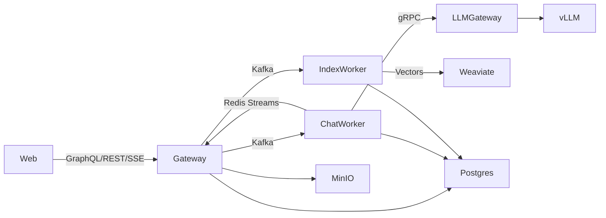

# Talkie

Talkie is a multi-service RAG and chat platform built around streaming LLM responses, file ingestion, and scalable worker pipelines. It pairs a GraphQL/REST gateway and a Next.js web app with Python workers and a Go gRPC LLM gateway. Kafka drives background jobs, Redis Streams power real-time SSE delivery, Postgres stores state and metrics, and Weaviate provides vector search.

## Architecture

- Web: Next.js UI that consumes GraphQL and SSE streams.
- Gateway: NestJS GraphQL/REST API with auth, chat, ingest, and streaming bridges.
- Workers: Python services for chat/RAG, indexing, and session/title tasks.
- LLM Gateway: Go gRPC service that fronts vLLM and normalizes streaming tokens.
- Infra: Postgres, Kafka, Redis, Weaviate, MinIO, Prometheus, Grafana (dev stack).



## Key flows

- Chat: Gateway enqueues `chat.request` to Kafka, Chat Worker runs GEN or RAG, streams tokens to Redis, Gateway relays SSE to the Web.
- Ingest: Gateway issues presigned uploads to MinIO, publishes `ingest.request`, Index Worker extracts text, chunks, embeds, and upserts vectors into Weaviate.

## Repository layout

- `apps/web`: Next.js client.
- `apps/gateway`: NestJS GraphQL/REST API.
- `apps/llm-gateway`: Go gRPC gateway for vLLM.
- `apps/workers/chat_worker`: Chat/RAG worker with streaming and metrics.
- `apps/workers/index_worker`: Ingest worker for extraction, chunking, and embeddings.
- `packages/events-contracts`: Shared Kafka payload schemas.
- `packages/types-zod`: Shared Zod schemas and types.
- `infra/docker`: Dev infrastructure (Postgres, Kafka, Redis, Weaviate, MinIO).
- `docs`: Architecture notes and feature specs.

## Prerequisites

- Node.js with pnpm (see `package.json` for the workspace version)
- Python 3.12 (see `.tool-versions`)
- Go 1.25 (LLM Gateway)
- Docker (for local infra)

## Local development

1. Install JS dependencies:
   ```bash
   pnpm install
   ```
2. Create a Python venv and install worker deps:
   ```bash
   python -m venv .venv
   . .venv/bin/activate
   pip install -r requirements.txt
   ```
3. Start dev infrastructure:
   ```bash
   make docker-up
   ```
4. Configure environment variables:
   - `apps/gateway/.env.local`: Postgres, Kafka, Redis, JWT, and S3/MinIO settings.
   - `apps/web/.env.local`: API and GraphQL endpoints.
   - `apps/workers/chat_worker/.env.local`: DB, Kafka, Redis, Weaviate, and LLM settings.
   - `apps/workers/index_worker/.env.local`: DB, Kafka, storage, and vector settings.
   - `apps/llm-gateway/.env.dev`: vLLM URL, timeouts, and model defaults.
5. Run services (separate terminals):
   ```bash
   make web
   make gateway
   make worker-chat
   make worker-index
   make llm-gateway
   ```

For a combined dev run (web, gateway, chat worker):
```bash
make dev-all
```

## Useful commands

- `pnpm -r lint` / `pnpm -r typecheck` / `pnpm -r build`
- `make docker-down` / `make docker-logs`
- `make verify-weaviate-vectors`

## Documentation

- `docs/features/web/overview.md`
- `docs/features/gateway/chat.md`
- `docs/features/gateway/ingest.md`
- `docs/features/workers/chat-worker.md`
- `docs/features/workers/index-worker.md`
- `docs/features/llm-gateway/overview.md`
- `docs/architecture/ingest-overview.md`
- `docs/architecture/chat-session-deletion-overview.md`
- `docs/architecture/outbox-overview.md`
- `docs/architecture/database-lifecycle.md`
