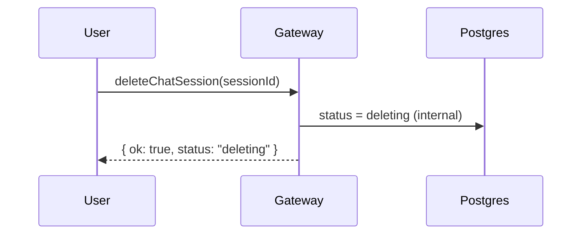

# Chat Session Deletion Flow

This document captures the current behavior for chat session deletion and the planned follow-ups.

## Current behavior (Gateway only)

- GraphQL mutation deleteChatSession marks the session status as deleting.
- The API returns immediately with { ok: true, status: "deleting" }.
- No outbox event or background cleanup is wired yet.

## Planned follow-ups

- Emit an outbox event (SESSION_DELETED) after marking the session.
- Add a worker or DB cascade to remove chat_messages for the session.
- Publish a session update event to Redis or GraphQL subscriptions.

## Query safety

Any session or message query should exclude sessions with status = deleting (and deleted once implemented).
