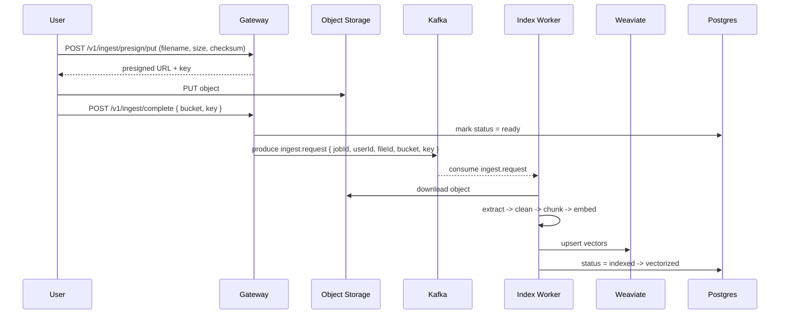
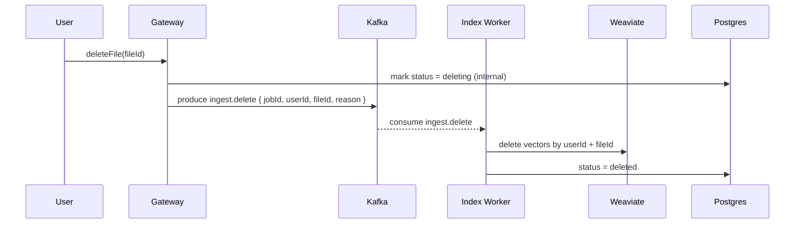

# Ingest Flow (Gateway -> Index Worker)

This document describes the end-to-end lifecycle for uploaded files: registration, upload, indexing, and deletion.

## Actors

- Gateway (REST/GraphQL)
- Object storage (MinIO/S3)
- Kafka (topics: ingest.request, ingest.delete)
- Index Worker
- Postgres (file metadata)
- Weaviate (vector store)
- Redis (user-scoped file events)

## Statuses

The shared FileStatus enum includes: pending, ready, indexed, vectorized, failed, deleted.
Gateway may set an internal "deleting" status before enqueueing cleanup; this state is not part of the shared schemas.

## Upload and indexing flow

## Deletion flow

## Events (UI and subscriptions)

User-facing file events are published over Redis:

- Channel: user:{userId}:files
- Types: file.registered, file.status.changed, file.visibility.changed, file.deleted
- Schema source: packages/events-contracts/src/ingest.ts

Indexing emits file.status.changed events as status moves ready -> indexed -> vectorized. Gateway emits
file.deleted when deletion is requested (before async cleanup completes).
