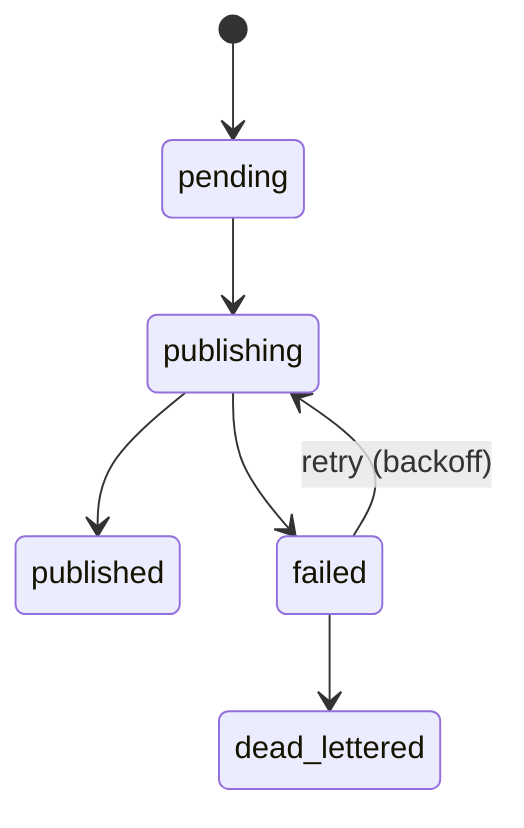

# Outbox Architecture

This document describes the OutboxModule used in Talkie for reliable, transactional message publishing.  
The Outbox pattern ensures that events are safely stored in the database and later delivered to Kafka through a batch worker, guaranteeing consistency even if the application or broker becomes temporarily unavailable.

---

## Overview

The Outbox system consists of two main components:

1. **OutboxRepository**  
   Stores outbox records, manages state transitions, and handles retry/backoff metadata.

2. **OutboxPublisherService**  
   A batch-based worker that periodically fetches pending or failed records, publishes them to Kafka, and updates their status.

The goal is to provide a robust infrastructure layer that enables reliable event delivery without coupling to application-level logic.

---

## Workflow

### 1. Record Creation (Transactional)
Whenever an event should be published:
- The application inserts an outbox record inside the same database transaction as the domain change.
- This guarantees atomicity between “write to DB” and “schedule event for publishing”.

### 2. Batch Polling
A periodic worker executes the following steps:

- Selects outbox rows with:
  - `status IN ('pending', 'failed')`
  - `next_attempt_at <= now()`
- Updates their status to `publishing` atomically
- Returns selected rows for processing

This prevents multiple workers from processing the same record.

### 3. Publish Attempt
For each locked row:
- Publish the message to Kafka using `KafkaService`
- If successful → `status = published`
- If failed → `status = failed` and:
  - Increment `retry_count`
  - Capture `last_error`
  - Set `next_attempt_at` using a simple backoff strategy
  - Move to `dead_lettered` when exceeding max retries

### 4. Worker Scheduling & Concurrency

The OutboxPublisherService executes at a fixed interval (e.g., every 1 second).  
Multiple worker instances can run in parallel because row selection uses:

- `FOR UPDATE SKIP LOCKED`

This ensures safe horizontal scaling and prevents duplicate processing across concurrent workers.

---

## Table Schema Summary

The `outbox` table contains fields supporting:

- Status transitions (`pending`, `publishing`, `published`, `failed`, `dead_lettered`)
- Retry tracking (`retry_count`, `last_error`, `last_attempt_at`, `next_attempt_at`)
- Idempotency (`topic`, `idempotency_key`)
- Messaging metadata (`topic`, `key`, `payload_json`)
- Operational observability (`published_at`, `created_at`)

Indexes optimize batch selection and DLQ scanning.

### Idempotency Strategy

The `(topic, idempotency_key)` unique constraint ensures that even if retries or 
race conditions cause multiple publish attempts, Kafka consumers receive only one
logical event. This prevents duplicate domain events from being processed downstream.

---

## State Machine



---

## Dead-Letter Handling

Records marked as `dead_lettered` remain stored for operator review.  
They can be manually inspected, resent, or purged depending on operational needs.  
This makes failure handling explicit and auditable rather than silently discarded.

---

## Future Improvements

- Prometheus metrics (success, failure, latency)
- Dead-letter dashboard
- Standalone worker service
- Dynamic interval and batch-size configuration

---

## Operational Examples

```sql
-- Find events that failed or entered the dead-letter state
SELECT *
FROM outbox
WHERE status IN ('failed', 'dead_lettered')
ORDER BY next_attempt_at;

-- Inspect pending items scheduled for retry
SELECT *
FROM outbox
WHERE status = 'failed'
  AND next_attempt_at <= now();
```

---

## Purpose

This module is part of the **infrastructure layer**, not the application domain.  
It provides a consistent, reusable mechanism for delivering events safely and is designed to remain stable even as higher-level features evolve.
