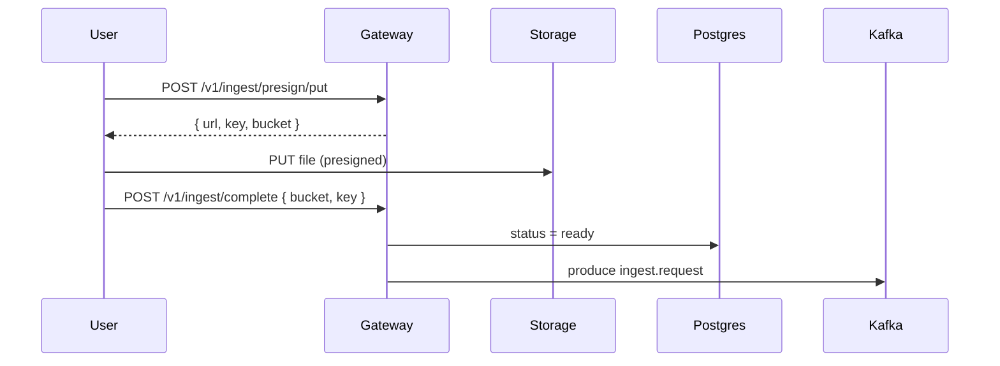

# Ingest Module Overview

The Ingest module manages file uploads and metadata lifecycle in the Gateway. It issues presigned URLs, records file status in Postgres, and publishes Kafka jobs for indexing and deletion.

## Responsibilities

- Presigned uploads to object storage (MinIO/S3).
- File metadata upsert and status tracking.
- Enqueue ingest.request for indexing and ingest.delete for cleanup.
- GraphQL queries, mutations, and subscriptions for files.

## Statuses

The shared FileStatus enum includes: pending, ready, indexed, vectorized, failed, deleted.
Gateway may set an internal deleting status before enqueueing cleanup.

## Example workflow

## GraphQL surface (high level)

- files(first, after)
- registerFile(input)
- deleteFile(fileId)
- fileStatusChanged(fileId)
