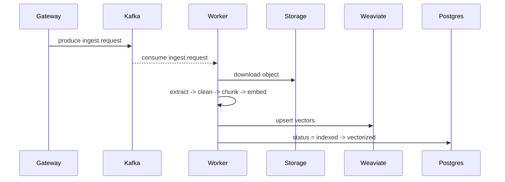

# Index Worker Overview

The Index Worker turns uploaded files into searchable vectors. It consumes ingest events, pulls objects from storage, extracts text, chunks, embeds, and upserts into Weaviate. It also updates metadata and emits user-facing status events.

## Responsibilities

- Consume Kafka topics ingest.request and ingest.delete.
- Download objects from MinIO/S3.
- Extract and clean text, then chunk it (token or markdown by default).
- Generate embeddings and upsert vectors into Weaviate.
- Update Postgres metadata (indexed, vectorized, failed, deleted).
- Publish file status events to Redis (user:{userId}:files).

## Data flow

Deletion uses ingest.delete and removes vectors by userId + fileId, then marks metadata deleted.

## Events

The worker publishes user-facing updates to Redis:

- Channel: user:{userId}:files
- Event type: file.status.changed (ready -> indexed -> vectorized)

Schema definitions live in packages/events-contracts/src/ingest.ts.

## Configuration (env)

- KAFKA_BOOTSTRAP
- DATABASE_URL
- WEAVIATE_URL
- WEAVIATE_COLLECTION (default: Chunks)
- EMBEDDING_MODEL
- S3_ENDPOINT, S3_ACCESS_KEY, S3_SECRET_KEY, S3_BUCKET, S3_REGION
- REDIS_URL
- OPENAI_API_KEY (embedding provider)
