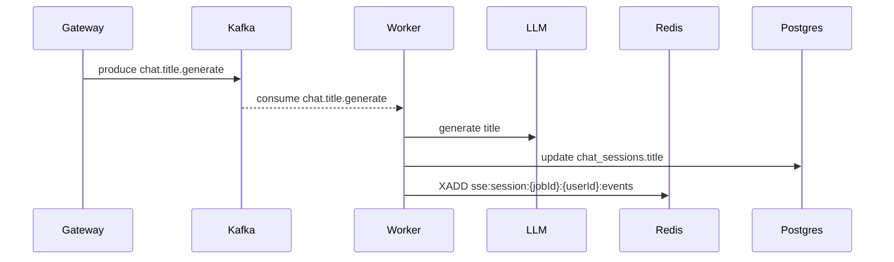

# Title Worker Overview

The Title Worker generates short, human-friendly titles for chat sessions. It is triggered asynchronously after new sessions are created.

## Responsibilities

- Consume Kafka topic chat.title.generate.
- Call the LLM with a title prompt.
- Update the session title in Postgres.
- Emit a Redis stream event for UI updates.

## Data flow

## Configuration (env)

The worker reuses chat_worker settings and expects:

- KAFKA_BOOTSTRAP
- REDIS_URL
- DB_URL (from chat_worker settings)
- LLM__OPENAI_API_KEY or LLM provider config
